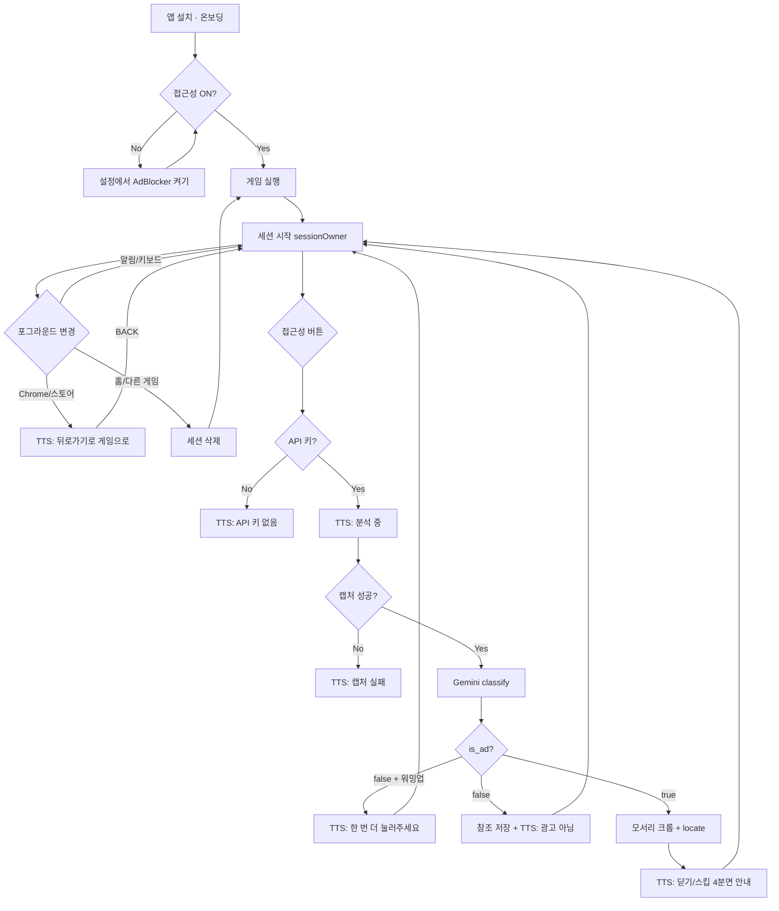

# AdBlocker 구현 가이드 (1~7단계)

> 이 문서는 구현 브리프 기준 **1~7단계**를 확인·진행하기 위한 메모입니다.  
> 설계·파이프라인 개념은 [`docs/PROJECT.md`](PROJECT.md)를 따릅니다.  
> 프롬프트 튜닝, 자동 클릭, git commit/PR은 범위 밖입니다.

**레포:** `C:\Users\86952\AndroidStudioProjects\AdBlocker`  
**패키지:** `com.example.adblocker`  
**서비스:** `AdBlockerAccessibilityService`  
**모델 ID:** `GeminiConfig.MODEL_ID` → `gemini-2.5-flash`  
**API 키:** `local.properties`의 `GEMINI_API_KEY=` → `BuildConfig.GEMINI_API_KEY`

---

## 진행 현황 요약


| 단계  | 내용                                   | 상태                         |
| --- | ------------------------------------ | -------------------------- |
| 1   | Gradle / 매니페스트 / 키 / 접근성 XML + 빈 서비스 | ✅ 완료                       |
| 2   | MainActivity 온보딩                     | ✅ 완료                       |
| 3   | 실기기 접근성 버튼 동작 확인                     | ✅ 완료 (실기기 테스트 필요)          |
| 4   | takeScreenshot + ImageUtils          | ✅ 코드 있음 (주석 처리, 3번과 동일 동작) |
| 4.5 | GameplaySessionStore + AdRedirectMonitor | ✅ 코드 있음 (주석 처리, 3번과 동일 동작) |
| 5   | NavBarDetector                       | ✅ 코드 있음 (주석 처리, 3번과 동일 동작) |
| 6   | GeminiApiClient + placeholder 프롬프트   | ✅ 코드 있음 (주석 처리, 3번과 동일 동작) |
| 7   | runPipeline + SpokenMessageBuilder   | ✅ 코드 있음 (주석 처리, 3번과 동일 동작) |
| 8   | 연속 탭 cancel / onDestroy / recycle    | ✅ 코드 있음 (주석 처리, 3번과 동일 동작) |


> **주석 해제 순서·묶음·중간 테스트는 [부록 H2](#부록-h2--주석-해제-순서와-중간-테스트-필독)를 먼저 읽으세요.**
> 단계를 건너뛰거나 일부만 켜면 컴파일이 깨지는 조합이 있습니다.

---

## 1~7단계 — 확인 체크리스트

각 단계마다 **무엇이 들어갔는지**, **어떻게 확인하는지**만 적었습니다.

---

### 1. Gradle / 매니페스트 / 키 / 접근성 XML + 빈 서비스 ✅

**구현된 파일**


| 파일                                                       | 역할                                                            |
| -------------------------------------------------------- | ------------------------------------------------------------- |
| `app/build.gradle.kts`                                   | `buildConfig = true`, OkHttp, coroutines, `GEMINI_API_KEY` 주입 |
| `gradle/libs.versions.toml`                              | OkHttp, coroutines 버전                                         |
| `app/src/main/AndroidManifest.xml`                       | `INTERNET`, 서비스 등록                                            |
| `app/src/main/res/xml/accessibility_service_config.xml`  | 접근성 능력 선언                                                     |
| `app/src/main/java/.../AdBlockerAccessibilityService.kt` | 버튼 → TTS                                                      |
| `app/src/main/java/.../GeminiConfig.kt`                  | `MODEL_ID = "gemini-2.5-flash"`                               |
| `app/src/main/res/values/strings.xml`                    | 접근성 서비스 설명 문자열                                                |


**확인 방법**

- [ ] Android Studio에서 빌드 성공
- [ ] 설정 → 접근성 목록에 **AdBlocker** 표시
- [ ] 서비스 ON 후, 다른 앱 위에서 **접근성 버튼** (제스처 내비: 보통 하단 두 손가락 스와이프)
- [ ] TTS: **「접근성 버튼이 동작합니다」**
- [ ] `onAccessibilityEvent`는 **분석·캡처·classify 자동 실행 없음** (4.5 이후: 세션 유지/삭제 + 리다이렉트 TTS만)

**아직 하지 않는 것**

- 스크린샷, Gemini API, 파이프라인

---

### 2. MainActivity 온보딩 ✅

**구현된 파일**


| 파일                                            | 역할             |
| --------------------------------------------- | -------------- |
| `app/src/main/java/.../MainActivity.kt`       | Compose 온보딩 UI |
| `app/src/main/java/.../AccessibilityUtils.kt` | 서비스 ON/OFF 읽기  |
| `app/src/main/res/values/strings.xml`         | 온보딩 문구         |


**화면 구성**

1. 앱 설명
2. **접근성 서비스: 켜짐 / 꺼짐** (코드로 읽어서 표시)
3. **접근성 설정 열기** 버튼 → `Settings.ACTION_ACCESSIBILITY_SETTINGS`
4. `GEMINI_API_KEY` 없으면 **경고 카드** (화면 안 안내, 팝업 아님)
5. 사용법 (서비스 켠 뒤 앱 안 열어도 됨)
6. (선택 문구) 광고 전 **플레이 화면**에서 버튼 1~2회 → 세션 참조 축적 안내 (MainActivity UI 변경 최소, `strings.xml` 한 줄)

**확인 방법**

- [ ] 앱 실행 시 Hello 화면 없음, 온보딩만 보임
- [ ] 서비스 꺼짐 → **「꺼짐」** (빨간색)
- [ ] 설정에서 AdBlocker ON → 앱 복귀 → **「켜짐」**
- [ ] 키 없이 빌드 → 경고 카드 보임
- [ ] `local.properties`에 키 넣고 재빌드 → 경고 카드 사라짐
- [ ] 분석 로직은 Activity에 없음 (서비스만)

---

### 3. 실기기 접근성 버튼 동작 확인 ✅

**구현된 보강 (1~2번 위에 추가)**


| 파일 / 항목                            | 역할                                                |
| ---------------------------------- | ------------------------------------------------- |
| `AdBlockerAccessibilityService.kt` | 버튼 클릭 Logcat (`AdBlockerA11y`), TTS 미준비 시 대기 후 재생 |
| `MainActivity.kt`                  | 서비스 **켜짐**일 때 **3단계 확인** 안내 카드                    |
| `strings.xml`                      | TTS 문장, 확인 단계 문구                                  |


**확인 방법**

- [ ] AdBlocker 접근성 서비스 ON → 온보딩에 **「3단계: 접근성 버튼 동작 확인」** 카드 표시
- [ ] 홈/게임 등 **다른 앱** 화면에서 접근성 버튼
- [ ] **「접근성 버튼이 동작합니다」** TTS
- [ ] Logcat: `AdBlockerA11y` 태그에 `accessibility_button_clicked` 로그
- [ ] 앱 전용 스와이프 / 터치 탐색 / 플로팅 버튼 없음

**이 단계 통과 전에 4~7을 넣지 않는 이유**

버튼이 안 들어오면, 이후 버그가 캡처/API 문제인지 트리거 문제인지 구분이 안 됩니다.

---

### 4. takeScreenshot + ImageUtils ✅ (주석 처리됨)

> **현재 동작:** 3번과 동일 (접근성 버튼 → 「접근성 버튼이 동작합니다」).  
> **활성화:** `#4. Screenshot` 검색 후 주석 해제.

**구현된 파일**


| 파일                                      | 역할                                                                   |
| --------------------------------------- | -------------------------------------------------------------------- |
| `ImageUtils.kt`                         | `toJpegBytes` / `toBase64` / `toJpegBase64`, `cropCorner(..., 0.3)` 4장 (전체 블록 주석) |
| `AdBlockerAccessibilityService.kt` (수정) | `captureScreenshotBitmap()` — `takeScreenshot()`을 `suspendCancellableCoroutine`으로 감싼 suspend 함수 (`#7 run` 블록 안) |
| `AdBlockerAccessibilityService.kt` (수정) | `captureScreenshotDebug()` — 4단계만 켜서 확인하는 단독 경로 (7단계에서 다시 주석) |
| `strings.xml`                           | 캡처 성공/실패 TTS (XML 주석)                                               |


**주석 해제 시 동작**

- `takeScreenshot(Display.DEFAULT_DISPLAY, mainExecutor, callback)`
- `wrapHardwareBuffer` → `copy(ARGB_8888)` → `hardwareBuffer.close()` **필수**
- 콜백 결과를 코루틴으로 되돌려 주므로, 캡처 대기 중에도 `#8 cancel`의 job 취소가 그대로 적용됨
- 취소된 뒤 콜백이 늦게 도착하면 Bitmap을 즉시 `recycle()` (누수 방지)
- 실패(FLAG_SECURE 등) → `null` 반환 → **「이 화면은 캡처할 수 없습니다.」**

> 캡처 함수는 두 개입니다. `captureScreenshotDebug()`는 **4단계만 켜서** 확인하는 용도(콜백 방식, TTS로 성공/실패 알림), `captureScreenshotBitmap()`은 **7단계 파이프라인용**(suspend, 취소 가능)입니다. 7단계를 켤 때 디버그 쪽은 다시 주석 처리합니다.

**확인 방법 (주석 해제 후)** — 상세 절차는 [부록 H2](#부록-h2--주석-해제-순서와-중간-테스트-필독) S1

- [ ] 일반 앱 화면 → 「화면 캡처에 성공했습니다.」 + Logcat `capture_ok base64_length=…`
- [ ] 은행/FLAG_SECURE 앱 → 캡처 실패 TTS
- [ ] 버튼 연타 후에도 크래시·프리즈 없음 (하드웨어 버퍼 누수 확인)

---

### 4.5 GameplaySessionStore + AdRedirectMonitor ✅ (주석 처리됨)

> **현재 동작:** 3번과 동일 (접근성 버튼 → 「접근성 버튼이 동작합니다」).  
> **활성화:** `#4.5 GameSession` 검색 후 주석 해제.

**구현된 파일**


| 파일                                      | 역할                                                                 |
| --------------------------------------- | ------------------------------------------------------------------ |
| `GameplaySessionStore.kt`               | `sessionOwnerPackage`, 참조 JPEG(최대 2), 일시 목적지 시 세션 유지 (전체 블록 주석) |
| `AdRedirectMonitor.kt`                  | 게임→일시 목적지 TTS debounce (전체 블록 주석) |
| `AdBlockerAccessibilityService.kt` (수정) | `onAccessibilityEvent` / `onDestroy` / 버튼 훅 (주석) |
| `strings.xml`                           | 리다이렉트·워밍업 TTS (XML 주석) |

> **위치:** 4번(캡처) 직후, 5번(NavBar) 전에 구현.  
> **목적:** (1) 게임 세션 동안 플레이 참조 JPEG 0~2장 — classify 맥락. (2) 광고 리다이렉트(브라우저/스토어/설치 앱) 시 **TTS 안내** + **세션 유지**.  
> **하지 않는 것:** Intent 차단, 자동 `BACK`, 자동 classify.

**GameplaySessionStore — 저장·삭제 규칙**


| 항목 | 규칙 |
| --- | --- |
| 저장 위치 | `cacheDir/gameplay_sessions/<sessionOwnerPackage>/` (git 없음) |
| 세션 주인 | 게임 포그라운드 시 `sessionOwnerPackage` = 그 `packageName` |
| **세션 유지** | owner → **일시 목적지**(Chrome, Play Store, AliExpress 등) → BACK으로 owner 복귀. **참조 삭제 안 함** |
| **세션 삭제** | **홈(런처)** · **다른 게임/앱**(일시 목적지·owner 제외) · **타임아웃**(예: 30분) · `onDestroy` → `clearSession` / `clearAll()` |
| 참조 추가 | `classify` 결과 `is_ad=false` **이후에만** |
| 세션 첫 버튼 | 참조 **저장 안 함** (워밍업). TTS: 플레이 화면에서 다시 눌러 달라는 안내 가능 |
| 참조 사용 | 세션에 **2장 이상**일 때만 6번 classify 요청에 포함. 0~1장이면 현재 화면 1장만 |
| 최대 장수 | 2장, FIFO |
| 저장 간격 | 연속 저장 시 최소 3~5초 |
| 판정 | 참조·하단바만으로 `is_ad=true` **금지** |


**일시 목적지 (transient) 예시 — 코드 상수, 추가 가능**

- `com.android.chrome` — Chrome  
- `com.android.vending` — Play Store  
- `com.alibaba.aliexpress` — AliExpress  
- 제조사 브라우저 등  

**AdRedirectMonitor — TTS 규칙**


| 항목 | 규칙 |
| --- | --- |
| 트리거 | `sessionOwnerPackage` 포그라운드 → **일시 목적지** 포그라운드 (`TYPE_WINDOW_STATE_CHANGED` 등) |
| TTS | **「브라우저나 스토어로 이동했을 수 있습니다. 뒤로가기를 눌러 게임으로 돌아가세요.」** |
| 스팸 방지 | 같은 리다이렉트 **에피소드**당 1회 (debounce) |
| 한계 | Custom Tabs / 인앱 WebView는 `packageName`이 게임과 같을 수 있음 → TTS 없을 수 있음. 접근성 버튼 분석은 별도 |

**게임 → 광고 리다이렉트 → 복귀 (설계 흐름)**

```
게임(sessionOwner) 플레이, ref 2장 축적
  → (오탭/자동) Chrome/Play Store 포그라운드
  → AdRedirectMonitor: TTS 「뒤로가기로 게임으로」 (세션 유지)
  → 사용자 BACK
  → 게임 복귀, ref 2장 그대로
  → 광고 화면에서 접근성 버튼 → classify(참조 2 + 현재 1)
```

**홈으로 나가면** 위 세션 전체 삭제 (ref부터 다시).

**확인 방법**

- [ ] 게임 A 플레이 → `is_ad=false` 버튼 2회 → Logcat `session_refs=2`
- [ ] 세션 첫 버튼 → 참조 파일 생성 없음
- [ ] 참조 1장만 있을 때 classify 요청에 참조 미포함
- [ ] 게임 → Chrome/Play Store → **TTS 안내** 1회, **세션 폴더 유지**
- [ ] BACK으로 게임 복귀 → ref 2장 그대로, classify에 참조 포함 가능
- [ ] **홈** 또는 **다른 게임** → A 세션 `cacheDir` 삭제
- [ ] `onDestroy` 후 세션 폴더 비움
- [ ] 자동 캡처·자동 classify 없음 (버튼 온디맨드 유지)

**게임 → 광고 리다이렉트 → 복귀 (설계 흐름)**

```
게임(sessionOwner) 플레이, ref 2장 축적
  → (오탭/자동) Chrome/Play Store 포그라운드
  → AdRedirectMonitor: TTS 「뒤로가기로 게임으로」 (세션 유지)
  → 사용자 BACK
  → 게임 복귀, ref 2장 그대로
  → 광고 화면에서 접근성 버튼 → classify(참조 2 + 현재 1)
```

**홈으로 나가면** 위 세션 전체 삭제 (ref부터 다시).

**하지 않는 것**

- 게임별 영구 라이브러리·등록 UI
- 참조용 두 번째 Gemini 호출
- `is_ad` 외 JSON 필드 추가
- **리다이렉트 차단**, **`performGlobalAction(BACK)`**, URL/VPN 필터

---

### 5. NavBarDetector ✅ (주석 처리됨)

> **현재 동작:** 3번과 동일. **활성화:** `#5 NavBar` 검색 후 주석 해제.

**구현된 파일:** `NavBarDetector.kt` (전체 블록 주석)

- `service.windows` → 하단 `TYPE_SYSTEM` 또는 앱 bounds vs 화면 높이
- Logcat: `AdBlockerNavBar` / `navBarVisible=true/false`
- **하단바만으로 광고 판정 금지** — `#7 run` 파이프라인에서 로그·필드만

**확인 방법 (주석 해제 + 7번 연동 후)**

- [ ] Logcat에 `navBarVisible=true/false` 출력
- [ ] 몰입 모드(바 숨김) vs 일반 앱에서 값이 달라짐

---

### 6. GeminiApiClient + placeholder 프롬프트 ✅ (주석 처리됨)

> **현재 동작:** 3번과 동일. **활성화:** `#6 LLM API` 검색 후 주석 해제.

**구현된 파일**

| 파일 | 역할 |
|------|------|
| `Models.kt` | `ScreenQuadrant`, `AdControlsResult`, `GeminiApiError` |
| `GeminiPrompts.kt` | `TODO: classify/locate` placeholder |
| `GeminiApiClient.kt` | REST `generateContent`, JSON schema, OkHttp 타임아웃 |

- `classifyAdScreen(current, referenceJpegB64s)` — 참조 2장 미만이면 단일 이미지
- `locateAdControls(full + corners)` — enum 스키마
- temperature 0, 재시도 없음, 키 없으면 `GeminiApiError.ApiKeyMissing`

**확인 방법 (주석 해제 + 7번 연동 후)**

- [ ] 키 있을 때 네트워크 요청 (Logcat)
- [ ] placeholder여도 JSON 파싱까지 도달
- [ ] 키 없음 / 비행기 모드 → 크래시 없이 TTS

---

### 7. runPipeline + SpokenMessageBuilder ✅ (주석 처리됨)

> **현재 동작:** 3번과 동일. **활성화:** `#7 run` 검색 후 주석 해제 (4·4.5·5·6·8과 함께).

**구현된 파일**

| 파일 | 역할 |
|------|------|
| `SpokenMessageBuilder.kt` | `Context`를 받는 **클래스**. 모든 문장을 `strings.xml`에서 읽음 (하드코딩 없음) |
| `AdBlockerAccessibilityService.kt` | `runPipeline`, `analyzeCapturedScreen`, `locateAdControls`, `captureScreenshotBitmap`, `logPipelineResult` (주석) |

**파이프라인 순서 (주석 해제 시)**

1. `#8 cancel` — 이전 `analysisJob` cancel → 새 job 시작
2. `#4.5` 세션 버튼 카운트 + 워밍업 여부 스냅샷 → 「화면을 분석 중입니다」
3. `#5 NavBar` 로그 → `#4` 캡처 (suspend)
4. 캡처 실패 / 키 없음 → TTS 후 종료
5. `#6` classify(현재 1장 + 참조 0~2장)
   - `false` + 워밍업 → 「플레이 화면에서 한 번 더」 (참조 저장 안 함)
   - `false` + 워밍업 아님 → 참조 축적 + 「광고 화면이 아닙니다」
   - `true` → 4모서리 크롭 → locate → 4분면 템플릿 TTS
6. `PipelineResult`를 Logcat에 남기고 Bitmap·corner recycle

**에러 → TTS 매핑**

| 예외 | TTS |
|------|-----|
| `GeminiApiError.ApiKeyMissing` | API 키가 없어 분석할 수 없습니다. |
| `GeminiApiError.NetworkError` (IOException) | 네트워크를 확인해 주세요. |
| `GeminiApiError.HttpError` / `ParseError` | 분석에 실패했습니다. 다시 눌러 주세요. |

**확인 방법**

- [ ] 버튼 → 파이프라인 TTS (placeholder 정답률 무시)
- [ ] 모델이 문장 생성하지 않음 (템플릿만)
- [ ] 4xx/5xx, JSON 깨짐, 비행기 모드 각각 다른 TTS

---

### 8. 연속 탭 cancel / onDestroy / recycle ✅ (주석 처리됨)

> **현재 동작:** 3번과 동일 (`speakNow`의 `QUEUE_FLUSH`만 이미 적용). **활성화:** `#8 cancel` 검색 후 주석 해제.

**구현 위치:** `AdBlockerAccessibilityService.kt`

- `CoroutineScope(SupervisorJob() + Main)` + `analysisJob`
- 연속 버튼 → `analysisJob?.cancel()` 후 최신만
- `onDestroy` → job cancel + scope cancel + `#4.5` `clearAll()`
- `#7 run`에서 Bitmap / corner recycle

**확인 방법**

- [ ] 연속 탭 시 이전 분석 중단, 최신 TTS만
- [ ] 서비스 OFF 후 누수·크래시 없음

---

## 부록 A — 단계별 상세 설명 (무엇을 / 왜)

### 1번: Gradle / 매니페스트 / 키 / 접근성 XML + 빈 서비스

**목적:** 분석 엔진이 아니라, **접근성 버튼 → 우리 서비스 → TTS**까지 OS가 우리 코드를 호출하게 만드는 기반.


| 항목                                 | 무엇을                            | 왜                         |
| ---------------------------------- | ------------------------------ | ------------------------- |
| OkHttp + coroutines                | 나중에 Gemini HTTP, 백그라운드 작업      | UI(서비스)가 네트워크 대기 중 죽지 않게  |
| `BuildConfig.GEMINI_API_KEY`       | `local.properties` 키를 빌드 시만 주입 | git/소스에 키 안 남김, 서버 없이 개인용 |
| `GeminiConfig.MODEL_ID`            | 모델 id 한곳                       | URL 여러 파일에 흩뿌리지 않음        |
| `INTERNET`                         | 네트워크 권한                        | 없으면 Gemini 호출 차단          |
| 서비스 매니페스트 등록                       | 설정 > 접근성 목록에 노출                | 등록 없으면 사용자가 켤 수 없음        |
| `accessibility_service_config.xml` | 캡처·버튼·윈도우 읽기 선언                | OS가 능력을 서비스에 부여           |
| 빈 서비스 + TTS                        | 버튼이 **우리 프로세스에 들어왔는지** 확인      | 캡처/API 전에 트리거 회로만 닫음      |
| `onAccessibilityEvent`            | **분석·캡처·classify 자동 없음**. 4.5: `GameplaySessionStore`(세션 유지/삭제) + `AdRedirectMonitor`(리다이렉트 TTS) | 버튼 온디맨드 유지. 광고 리다이렉트 시 세션·안내 |


**accessibility_service_config.xml 플래그**


| 플래그                              | 역할                                            |
| -------------------------------- | --------------------------------------------- |
| `flagRequestAccessibilityButton` | 시스템 접근성 버튼 → `AccessibilityButtonController` 콜백 |
| `canTakeScreenshot`              | API 30 `takeScreenshot()` (minSdk 30 이유)      |
| `canRetrieveWindowContent`       | `windows`로 하단 내비 바 등 (5번)                     |


---

### 2번: MainActivity 온보딩

**목적:** 설치 직후 사용자가 **서비스를 켜고, 키 상태를 아는** 화면. 분석은 하지 않음.


| 항목              | 무엇을                                         | 왜                                   |
| --------------- | ------------------------------------------- | ----------------------------------- |
| 서비스 ON/OFF 표시   | 코드로 OS 상태 **읽어서** 앱에 표시                     | 설정 갔다 와도 앱에서 바로 확인                  |
| 설정 열기 버튼        | `ACTION_ACCESSIBILITY_SETTINGS`             | 목록은 깊어서 입구까지 앱이 연다. **ON은 사용자가 직접** |
| API 키 경고 카드     | `BuildConfig.GEMINI_API_KEY` 비어 있으면 화면 안 카드 | 크래시 대신 미리 알림. 팝업/토스트 아님             |
| Activity에 분석 없음 | 캡처·API·TTS는 서비스                             | 분석 시점에 **광고/게임 화면**이 앞에 있어야 함       |


**사용자 흐름**

```
앱 설치 → MainActivity(온보딩)
       → 접근성 설정에서 AdBlocker ON
       → 다른 앱으로 나감
       → 접근성 버튼 → 서비스가 분석 (Activity 포그라운드 불필요)
```

---

### 3번: 실기기 확인 게이트

**목적:** 1~2가 만든 **트리거 루프**(버튼 → 서비스 → TTS)가 실기기에서 동작하는지 검증. 통과 전 4~7 넣지 않음.

**추가한 것**

- 서비스: Logcat `AdBlockerA11y` / `accessibility_button_clicked`, TTS 준비 전 버튼 탭 시 대기 후 재생
- 온보딩: 서비스 **켜짐**일 때만 **3단계 확인** 카드 (다른 앱에서 버튼 누르는 방법)

**사용자가 할 일:** 실기기에서 버튼 → TTS 한 번 들어보기 (에뮬레이터는 접근성 버튼이 없거나 다를 수 있음).

---

### 4번: takeScreenshot + ImageUtils

**목적:** 버튼 → **현재 화면 JPEG**까지. 아직 Gemini 없음.

- MediaProjection 다이얼로그 없이 API 30+ 접근성 1회 허용으로 온디맨드 캡처
- 하드웨어 Bitmap은 `compress` 불가 → 소프트웨어 복사 후 JPEG
- `hardwareBuffer.close()` 필수 (누수 방지)
- FLAG_SECURE → onFailure → 고정 TTS

---

### 4.5번: GameplaySessionStore + AdRedirectMonitor

**GameplaySessionStore 목적:** 같은 게임 세션에서 classify **맥락 이미지** 0~2장. 영구 라이브러리·픽셀 비교 없음.

- **`sessionOwnerPackage`** — 게임 package를 세션 주인으로 기억
- **일시 목적지**(Chrome, Play Store, AliExpress 등)로 나갔다 **BACK** 복귀 → **참조 유지** (광고 리다이렉트 대응)
- **홈·다른 게임·타임아웃** → 세션 삭제
- `is_ad=false` 확정 후에만 참조 축적
- 세션 첫 버튼·참조 2장 미만 규칙
- 참조만으로 광고 확정 금지

**AdRedirectMonitor 목적:** 리다이렉트 **예방 불가** → **TTS만**으로 「뒤로가기로 게임으로」 안내.

- 게임 → 일시 목적지 전환 감지 (`onAccessibilityEvent`)
- 고정 TTS, 에피소드당 1회 debounce
- **자동 BACK·Intent 차단 없음**
- 세션 삭제와 **분리** (monitor는 store를 clear하지 않음)

---

### 5번: NavBarDetector

**목적:** 스크린샷이 아닌 **접근성 windows**로 하단 내비 바 보임 여부 (약한 힌트).

- 게임 몰입 모드 vs 광고 Activity에서 바 재등장 구분용
- **하단바만으로 광고 판정 금지**

---

### 6번: GeminiApiClient

**목적:** 프롬프트 내용 제외하고 **호출·스키마·파싱·에러** 골격.

- `classifyAdScreen(current, referenceJpegB64s)` — 참조는 **별도 API가 아니라** classify 입력 확장
- 참조 2장 미만이면 기존과 동일한 단일 이미지 classify
- `responseMimeType=application/json` + `responseSchema`
- 자연어 파싱 금지, 필드만 읽음
- 프롬프트는 `GeminiPrompts.kt`에 TODO placeholder
- 재시도 없음 (버튼 재탭 = 재시도)

---

### 7번: runPipeline + SpokenMessageBuilder

**목적:** 캡처 → (세션 참조 조회) → 분류 → (조건부) 위치 → **고정 한국어 TTS**.

- 모델이 문장 짓지 않음 (환각 방지)
- 4분면 enum → 「왼쪽 위 / 오른쪽 위 / …」 맵만
- classify `true`일 때만 locate (비용·지연)
- `is_ad=false` 후 `maybeAddReference` (4.5 규칙)

---

## 부록 B — Android 파일 종류와 역할 (초보용)

앱은 **코드(.kt)** 와 **설정 파일**이 같이 동작합니다.


| 종류                   | 이 프로젝트 예                                   | 하는 일                                 |
| -------------------- | ------------------------------------------ | ------------------------------------ |
| **Activity**         | `MainActivity.kt`                          | 아이콘 눌러 **열리는 화면**. 온보딩만.             |
| **Service**          | `AdBlockerAccessibilityService.kt`         | 화면 없이 **백그라운드**. 버튼 대기·캡처·TTS.       |
| **매니페스트**            | `AndroidManifest.xml`                      | OS용 **명함**: 권한, Activity/Service 목록. |
| **리소스 XML**          | `res/xml/accessibility_service_config.xml` | 접근성 서비스 **능력 목록**.                   |
| **Gradle**           | `app/build.gradle.kts`                     | **빌드 설명서**: SDK, 라이브러리, 키 주입.        |
| **local.properties** | git 제외                                     | 이 PC만: SDK 경로, `GEMINI_API_KEY=`.    |


코드를 잘 짜도 **매니페스트에 서비스가 없으면** 설정 목록에 안 나옵니다.  
**Gradle에 키 주입이 없으면** 앱은 Gemini 주소를 알아도 인증 문자열이 없습니다.

---

## 부록 C — 왜 접근성 프로젝트인가

한 줄: **다른 앱 위에서, 사용자가 누른 순간 화면을 찍고 말로 안내하려면 Android가 허용하는 공식 경로가 AccessibilityService**이기 때문.


| 필요한 것        | 일반 앱                      | 접근성 서비스                               |
| ------------ | ------------------------- | ------------------------------------- |
| 다른 앱 화면 캡처   | ❌ (MediaProjection 다이얼로그) | ✅ `takeScreenshot()` (API 30+, 1회 설정) |
| 앱 밖에서 버튼 트리거 | ❌ (오버레이 권한 필요)            | ✅ 접근성 버튼                              |
| 화면 창/노드 정보   | ❌                         | ✅ `windows`, 노드 트리 (2안)               |


이 앱은 광고 **차단(VPN/필터)** 이 아니라, 전면 광고 **위치를 TTS로 안내** (자동 클릭 없음)입니다.

원 설계: [`docs/PROJECT.md`](PROJECT.md) (같은 `docs/` 폴더)

---

## 부록 D — Gradle 키 주입 (자세히)

**흐름**

```
local.properties          app/build.gradle.kts          앱 코드
GEMINI_API_KEY=abc...  →  buildConfigField(...)     →  BuildConfig.GEMINI_API_KEY
(gitignore)               (빌드할 때만 읽음)            (생성된 상수)
```

**왜 이렇게 하나**

- 소스에 키 문자열 → git 유출
- 개인용이라 로그인 서버 없음 → BuildConfig 주입이 가장 단순
- 키 없으면 빈 문자열 → 온보딩 경고 + API 호출 스킵

**OkHttp / coroutines (1번에 같이 넣은 이유)**

- OkHttp: Gemini REST 호출용 HTTP 클라이언트
- coroutines: 서비스에서 IO(네트워크) 후 Main(TTS) 전환

---

## 부록 E — 매니페스트 서비스 등록 (자세히)

**INTERNET**

```xml
<uses-permission android:name="android.permission.INTERNET" />
```

→ Gemini HTTPS 허용.

**서비스 블록**

```xml
<service
    android:name=".AdBlockerAccessibilityService"
    android:exported="false"
    android:permission="android.permission.BIND_ACCESSIBILITY_SERVICE">
    <intent-filter>
        <action android:name="android.accessibilityservice.AccessibilityService" />
    </intent-filter>
    <meta-data
        android:name="android.accessibilityservice"
        android:resource="@xml/accessibility_service_config" />
</service>
```


| 속성                           | 의미                   |
| ---------------------------- | -------------------- |
| `BIND_ACCESSIBILITY_SERVICE` | 설정 앱만 이 서비스를 붙일 수 있음 |
| `intent-filter`              | 설정 > 접근성 목록에 표시      |
| `meta-data` → XML            | 캡처·버튼·윈도우 읽기 선언      |


**설치 후 흐름**

```
설정에서 AdBlocker ON
  → OS가 AdBlockerAccessibilityService 기동
  → onServiceConnected()에서 AccessibilityButtonController에 콜백 등록
  → 접근성 버튼 탭 → AccessibilityButtonCallback.onClicked()
  → (현재) TTS 「접근성 버튼이 동작합니다」
```

코드로 접근성 **자동 ON 불가** (OS 정책). 온보딩은 설정 화면까지만 연다.

---

## 부록 F — 온보딩 「경고」와 「ON 표시」 (2번 질문 정리)

### ON 여부 표시 ≠ 설정 redirection


|     | ON 표시                                               | 설정 버튼                           |
| --- | --------------------------------------------------- | ------------------------------- |
| 역할  | 앱에 **켜짐/꺼짐** 텍스트                                    | 설정 앱 **열기**                     |
| 방법  | `Settings.Secure.ENABLED_ACCESSIBILITY_SERVICES` 읽기 | `ACTION_ACCESSIBILITY_SETTINGS` |
| 시점  | `onResume`마다 갱신                                     | 사용자가 탭할 때                       |


설정으로 보내는 것만으로 ON 표시를 대체하지 **않습니다.**  
앱이 먼저 상태를 보여 주고, 꺼져 있으면 버튼으로 설정까지 안내합니다.

### API 키 「경고」

- **시스템 팝업/토스트 아님**
- Compose **경고 카드** (errorContainer 색)
- `BuildConfig.GEMINI_API_KEY.isBlank()` 일 때만 표시
- 키 넣고 **재빌드**해야 사라짐 (런타임에 파일 수정만으로는 BuildConfig 안 바뀜)

---

## 부록 G — 완료 기준 (브리프 8절)

전체 구현 후:

- [ ] 접근성 ON → 버튼 → TTS
- [ ] 일반 화면: 캡처 + (키 있으면) classify + 템플릿 TTS
- [ ] 참조 2장 축적 후 classify 요청에 참조 이미지 포함
- [ ] **홈/다른 게임** 전환 후 세션 참조 삭제
- [ ] **게임→Chrome/스토어→BACK** 복귀 시 세션 참조 **유지** + 리다이렉트 TTS
- [ ] FLAG_SECURE: 캡처 실패 문장
- [ ] 키 없음 / 비행기 모드: 크래시 없이 TTS
- [ ] 자동 클릭 없음, 터치 탐색 없음
- [ ] `GeminiPrompts.kt`에 TODO placeholder만
- [ ] 이미지·키 git 없음
- [ ] `scripts/eval_gemini_flash.py` 미수정

---

## 부록 H — 권장 파일 트리 (완성 시)

```
app/src/main/java/com/example/adblocker/
├── MainActivity.kt                 ✅
├── AccessibilityUtils.kt           ✅
├── AdBlockerAccessibilityService.kt ✅ (4~8에서 확장)
├── GeminiConfig.kt                 ✅
├── GeminiApiClient.kt              ✅ (주석)
├── GeminiPrompts.kt                ✅ (주석)
├── GameplaySessionStore.kt         ✅ (주석)
├── AdRedirectMonitor.kt            ✅ (주석)
├── ImageUtils.kt                   ✅ (주석)
├── Models.kt                       ✅ (주석)
├── NavBarDetector.kt               ✅ (주석)
└── SpokenMessageBuilder.kt         ✅ (주석)

app/src/main/res/xml/
└── accessibility_service_config.xml ✅
```

---

## 부록 H2 — 주석 해제 순서와 중간 테스트 (필독)

각 상태를 **실제로 빌드해서** 확인했습니다 (`:app:compileDebugKotlin` + `:app:mergeDebugResources`).
아래 5개 상태는 모두 **에러 0**입니다.

| 상태 | 켜는 태그 | 빌드 | 실기기에서 확인 가능한 것 |
|------|-----------|------|--------------------------|
| S0 | (현재) | ✅ | 버튼 → 「접근성 버튼이 동작합니다」 |
| S1 | `#4. Screenshot` | ✅ | 캡처 성공/실패 TTS |
| S2 | + `#4.5 GameSession` | ✅ | 세션 owner 로그, 리다이렉트 TTS |
| S3 | + `#5 NavBar` | ✅ | `navBarVisible` 로그 |
| S4 | + `#6 LLM API` | ✅ | (실행 경로 없음 — 빌드만) |
| S5 | + `#7 run` + `#8 cancel` | ✅ | 전체 파이프라인 |

> **반드시 누적(cumulative)으로 진행하세요.** S3은 「5만 켠 상태」가 아니라 「4 + 4.5 + 5」입니다.
> 뒤 단계를 켠 뒤 앞 단계를 다시 주석 처리하면 컴파일이 깨집니다.

### 함께 켜야 하는 묶음 (따로 켜면 컴파일 에러)

| 묶음 | 같이 켜야 하는 이유 |
|------|---------------------|
| `#4.5`의 `GameplaySessionStore.kt` + `AdRedirectMonitor.kt` | 모니터가 스토어를 생성자로 받음 |
| `#6`의 `Models.kt` + `GeminiPrompts.kt` + `GeminiApiClient.kt` | 클라이언트가 두 파일을 모두 참조 |
| **`#7 run` + `#8 cancel`** | 파이프라인이 `serviceScope`·`analysisJob`에서 실행됨. **7만 켜면 `serviceScope` 미해결로 컴파일 에러** |
| `#7 run` 켤 때 앞의 **4 · 4.5 · 5 · 6 전부** | `runPipeline`이 `ImageUtils`, `GameplaySessionStore`, `NavBarDetector`, `GeminiApiClient`, `Models`를 모두 씀 |

`#5 NavBar`는 어디에도 의존하지 않으므로 순서를 바꿔도 되지만, 로그로 값을 보려면 4가 먼저 켜져 있는 편이 편합니다.

---

### S1 — `#4. Screenshot`

**켜기**

1. `ImageUtils.kt` — `/* */` 제거
2. `strings.xml` — `#4. Screenshot — TTS strings` 블록의 `<!--` / `-->` 제거
3. `AdBlockerAccessibilityService.kt`
   - `#4. Screenshot — imports` (`Bitmap`, `Display`)
   - `#4. Screenshot — 단독 디버그 캡처 함수` — `/* */` 제거
   - `#4. Screenshot — 단독 디버그 캡처 (4단계 …)` — `captureScreenshotDebug()` 호출 한 줄
   - **`speak(getString(R.string.tts_accessibility_button_ok))` 줄은 주석 처리** (캡처 TTS와 겹침)

**중간 테스트 (여기서 멈추고 반드시 확인)**

- [ ] 일반 앱(설정, 게임) 화면에서 버튼 → **「화면 캡처에 성공했습니다.」**
- [ ] Logcat `AdBlockerA11y`에 `capture_ok base64_length=…` — 값이 수만 단위여야 정상 (0이면 압축 실패)
- [ ] 은행 앱 등 **FLAG_SECURE** 화면에서 버튼 → **「이 화면은 캡처할 수 없습니다.」**
- [ ] 버튼을 10회 이상 연타 → 크래시·프리즈 없음 (`hardwareBuffer.close()` 확인)

> 여기서 캡처가 안 되면 6~7단계의 오류가 「캡처 문제」인지 「API 문제」인지 구분할 수 없습니다. 반드시 통과시키고 넘어가세요.

---

### S2 — `+ #4.5 GameSession`

**켜기**

1. `GameplaySessionStore.kt`, `AdRedirectMonitor.kt` — `/* */` 제거 (**둘 다**)
2. `strings.xml` — `#4.5 GameSession — TTS strings` 블록
3. `accessibility_service_config.xml` — `typeAllMask` → `typeWindowStateChanged`, `flagRetrieveInteractiveWindows` 추가 (파일 상단 XML 주석 참고)
4. 서비스 4곳: `session store + redirect monitor`(필드) · `init store + monitor`(onCreate) · `session keep/clear`(onAccessibilityEvent) · `drop every cached reference`(onDestroy)
5. 서비스 `#4.5 GameSession — 단독 디버그 로그` (버튼 핸들러)

**중간 테스트**

- [ ] 게임 실행 → Logcat `AdBlockerGameSession`에 `session started for <게임 패키지>`
- [ ] 게임에서 버튼 → `session_owner=<게임> refs=0`
- [ ] 게임 → Chrome/Play Store로 이동 → **TTS 1회** 「브라우저나 스토어로 이동했을 수 있습니다…」
- [ ] 같은 브라우저에서 화면을 여러 번 바꿔도 **TTS 반복 안 됨** (에피소드당 1회)
- [ ] BACK으로 게임 복귀 → `session cleared` 로그 **없음** (세션 유지)
- [ ] 홈 버튼 → `session cleared for <게임>` 로그
- [ ] 알림창·키보드만 떴을 때 `session cleared` 로그 **없음** (시스템 overlay 필터)

> **`refs=0`이 정상입니다.** 참조 저장은 `is_ad=false` 판정 뒤에만 일어나고, 판정은 6~7단계에서 붙습니다. 여기서 참조 장수를 기대하면 안 됩니다.
>
> 리다이렉트 TTS가 안 들리면 Logcat에서 실제 패키지명을 확인해 `GameplaySessionStore.TRANSIENT_PACKAGES` / `LAUNCHER_PACKAGES`에 추가하세요. 기종·브라우저마다 다릅니다. **이 목록 실측이 4.5단계의 핵심 산출물입니다.**

---

### S3 — `+ #5 NavBar`

**켜기**

1. `NavBarDetector.kt` — `/* */` 제거
2. 서비스 `#5 NavBar — 단독 디버그 로그` (버튼 핸들러 한 줄)

**중간 테스트**

- [ ] 일반 앱에서 버튼 → `navBarVisible=true`
- [ ] 전체화면 게임/동영상에서 버튼 → `navBarVisible=false`
- [ ] 두 값이 **똑같이 나오면** `screenHeightPx` 또는 `BOTTOM_ZONE_FRACTION` 조정 필요 (판정에는 쓰이지 않으니 진행은 가능)

---

### S4 — `+ #6 LLM API`

**켜기**

1. `Models.kt`, `GeminiPrompts.kt`, `GeminiApiClient.kt` — `/* */` 제거 (**셋 다**)
2. 서비스 `#6 LLM API — client` (필드 한 줄)

**중간 테스트 — 앱에는 실행 경로가 없습니다**

- [ ] 빌드만 통과하면 OK (버튼 동작은 S1과 동일)
- [ ] `local.properties`에 `GEMINI_API_KEY=` 넣고 재빌드 → 온보딩의 빨간 경고 카드 사라짐 확인
- [ ] 프롬프트·스키마 검증은 **앱 밖에서** `scripts/eval_gemini_flash.py` + `testdata/`로 (Kotlin 빌드 사이클 없이 반복 가능)

> 6단계를 앱에서 실행해 보려면 7단계가 필요합니다. 여기서 「아무 일도 안 일어난다」는 것이 정상입니다.

---

### S5 — `+ #7 run` `+ #8 cancel` (마지막)

**켜기**

1. `SpokenMessageBuilder.kt` — `/* */` 제거
2. `strings.xml` — `#7 run — pipeline TTS templates` 블록
3. 서비스: `#7 run — imports`, `#8 cancel — imports`
4. 서비스 필드: `#8 cancel — one scope`, `#7 run — resource-backed`
5. 서비스 `onCreate`: `#7 run — init templates`
6. 서비스 `onDestroy`: `#8 cancel — stop in-flight`, `#7 run — release templates`
7. 서비스 `#7 run — full pipeline` — `/* */` 제거
8. 서비스 버튼 핸들러: `#7 run / #8 cancel` 블록 해제

**동시에 되돌려야 하는 것 (중요)**

- [ ] `speak(getString(R.string.tts_accessibility_button_ok))` — 삭제 또는 주석 (S1에서 이미 했다면 그대로)
- [ ] `#4. Screenshot — 단독 디버그 캡처 (4단계 …)` 호출 줄 → **다시 주석**
- [ ] `#4. Screenshot — 단독 디버그 캡처 함수` → **다시 주석** (안 하면 미사용 함수)
- [ ] `#4.5 GameSession — 단독 디버그 로그` → **다시 주석** (안 하면 버튼 카운트 이중 증가 위험)
- [ ] `#5 NavBar — 단독 디버그 로그` → **다시 주석** (파이프라인이 이미 호출)

> 실수로 이 4개를 그대로 둬도 **빌드는 깨지지 않습니다.** `#7` 블록이 `return`으로 끝나기 때문에 그 아래 디버그 줄들이 도달 불가 코드가 되어 실행되지 않습니다(검증함). 다만 죽은 코드가 남으니 정리하는 편이 낫습니다.

**중간 테스트**

- [ ] 일반 화면에서 버튼 → 「화면을 분석 중입니다」 → 「지금은 광고 화면이 아닙니다」
- [ ] 세션 **첫 버튼** → 「플레이 화면에서 접근성 버튼을 한 번 더 눌러 주세요」 (참조 저장 안 됨)
- [ ] 두 번째 버튼부터 `AdBlockerGameSession`에 `session_refs=1` → `=2`
- [ ] 4초 안에 연속으로 눌러도 참조가 1장씩만 늘어남 (저장 간격 제한)
- [ ] 광고 화면에서 버튼 → 「전면 광고입니다. 닫기 버튼은 … 스킵은 …」
- [ ] Logcat `pipeline_result=PipelineResult(...)`에 `navBarVisible`, `referenceCount`, `isAd` 기록
- [ ] **비행기 모드** → 「네트워크를 확인해 주세요.」
- [ ] `local.properties`에서 키를 비우고 재빌드 → 「API 키가 없어 분석할 수 없습니다.」
- [ ] **연타 테스트:** 버튼을 1초 간격으로 5회 → 이전 분석이 취소되고 **마지막 결과 하나만** 안내
- [ ] 설정에서 서비스 OFF → 크래시 없음, `cacheDir/gameplay_sessions` 비워짐

> 프롬프트가 `TODO:` placeholder이므로 **정답률은 이 시점에 평가하지 마세요.** 여기서 볼 것은 「파이프라인이 끝까지 흐르고, 각 실패 경로가 서로 다른 문장으로 안내되는지」입니다.

---

### 문제가 생겼을 때 되돌리는 기준

| 증상 | 확인할 단계 |
|------|-------------|
| 버튼 자체가 안 먹음 | S0 (3단계) — 접근성 서비스 ON, 제조사 버튼 설정 |
| TTS가 안 들림 | S0 — Logcat `TTS ready`, 한국어 TTS 엔진 설치 |
| 캡처만 실패 | S1 — FLAG_SECURE인지, `canTakeScreenshot` 선언 확인 |
| 리다이렉트 안내가 없음 | S2 — `TRANSIENT_PACKAGES`에 실제 패키지명 추가 |
| 참조가 안 쌓임 | S5 — 세션 첫 버튼인지, 4초 간격인지, `is_ad=false`인지 |
| 항상 「분석에 실패했습니다」 | S4 — 스키마/프롬프트. `eval_gemini_flash.py`로 앱 밖에서 재현 |
| 연타 시 결과가 섞임 | S5 — `#8 cancel` 블록이 전부 켜졌는지 |

---

## 부록 I — 주석 해제 상태 점검 결과 (수정 내역)

주석을 **전부 해제한 사본**으로 `:app:assembleDebug` + `:app:lintDebug`를 실행해 검증했습니다.
**결과: 컴파일 에러 0, Kotlin 경고 0, lint 에러 0** (남은 lint 21건은 라이브러리 버전 안내·미사용 기본 색상 등 기존 항목).

발견해서 고친 문제들:

| # | 파일 | 문제 | 수정 |
|---|------|------|------|
| 1 | `Models.kt` | `sealed class GeminiApiError : Exception()` 인데 하위 클래스가 `GeminiApiError(message)`로 호출 → **컴파일 에러** | `sealed class GeminiApiError(message: String, cause: Throwable? = null) : Exception(message, cause)` |
| 2 | 서비스 | `TakeScreenshotCallback` import 경로가 `android.view.accessibility.…`로 잘못됨 → **컴파일 에러** (Kotlin은 상위 클래스의 중첩 타입을 단순 이름으로 상속하지 않음) | import 제거하고 `AccessibilityService.TakeScreenshotCallback` / `AccessibilityService.ScreenshotResult`로 한정 |
| 3 | 서비스 | 같은 패키지끼리 `import com.example.adblocker.…` → 불필요한 import | 삭제 |
| 4 | 서비스 (`#8 cancel`) | `analysisJob`을 바깥 job → 캡처 콜백 안에서 **다시 덮어씀**. 콜백이 늦게 오면 취소가 새 job을 지워 **파이프라인 2개 동시 실행** | `captureScreenshotBitmap()`을 `suspendCancellableCoroutine`으로 만들어 **버튼 1탭 = job 1개** |
| 5 | 서비스 | 취소된 뒤 도착한 캡처 Bitmap이 recycle 없이 버려짐 | `continuation.isActive`가 false면 즉시 `recycle()` |
| 6 | 서비스 | `lateinit var`로 세션/모니터 보유 → `onCreate` 실패 시 `UninitializedPropertyAccessException` 위험 | nullable + `?.` 호출로 변경 |
| 7 | `NavBarDetector.kt` | `service.defaultDisplay` 같은 존재하지 않는/UI Context 전용 API로 화면 높이를 얻으려 함 | `DisplayManager.getDisplay(DEFAULT_DISPLAY)` + `getRealMetrics` (Service Context에서 안전) |
| 8 | `NavBarDetector.kt` | `AccessibilityNodeInfo.recycle()` 호출 (API 33+ deprecated, 재사용 시 `IllegalStateException` 위험) | 호출 제거 |
| 9 | `GameplaySessionStore.kt` | `expireSessionIfTimedOut()`이 **타임스탬프 갱신 뒤에** 호출돼 30분 타임아웃이 사실상 동작하지 않음 | 이벤트/버튼 처리 **맨 앞**으로 이동 |
| 10 | `GameplaySessionStore.kt` | `lastReferenceSavedAtMs = 0`인 첫 저장이 간격 검사에 걸려 막힘 | `!= 0L` 조건 추가 |
| 11 | `GameplaySessionStore.kt` | `file.writeBytes` / `mkdirs` 실패 시 `IOException`이 파이프라인까지 전파 | `try/catch(IOException)` + 경고 로그 |
| 12 | `GameplaySessionStore.kt` | `referencesFor` / `maybeAddReference`가 `packageName == null`일 때 owner와 불일치로 처리 | null이면 owner 기준으로 통과 |
| 13 | `GeminiApiClient.kt` | JSON 파싱 실패도 `NetworkError`로 뭉개져 **「네트워크를 확인해 주세요」** 오안내 | `IOException` → `NetworkError`, `JSONException` → `ParseError`로 분리 |
| 14 | `SpokenMessageBuilder.kt` | 한국어 문장이 코드에 하드코딩되어 `strings.xml`과 **이중 관리** | `Context`를 받는 클래스로 바꿔 전부 `getString` |
| 15 | `AdRedirectMonitor.kt` | 자체 TTS 문자열 상수 보유 + 직전 포그라운드가 정확히 owner일 때만 안내 (중간 이벤트 하나로 안내 누락) | 문장은 `SpokenMessageBuilder`로, 판정은 `sessionOwner != null && isTransient(현재)`로 완화 |
| 16 | `MainActivity.kt` | `var refreshTrigger by mutableIntStateOf(0)` — `remember` 없음 → 재구성마다 초기화되어 **설정 다녀와도 ON/OFF가 갱신 안 됨** | `remember { mutableIntStateOf(0) }` |
| 17 | `strings.xml` | 파이프라인 TTS 문자열 누락 (4분면·라벨·에러) | `#7 run` 블록에 전부 추가 |
| 18 | 서비스 `#4.5` init | 리다이렉트 TTS를 `spokenMessages`(= `#7` 소유 필드)로 읽어서 **4.5만 켜면 컴파일 불가** | `getString(R.string.tts_ad_redirect_hint)` 직접 호출로 변경 (`SpokenMessageBuilder.adRedirectHint()` 삭제) |
| 19 | 서비스 `#4` | 4단계 단독 실행 경로가 없어 **캡처만 따로 테스트할 수 없음** | `captureScreenshotDebug()` + `tts_capture_ok` 복원, 7단계에서 다시 주석 처리하도록 표시 |
| 20 | 서비스 `#5` | 5단계 단독 확인 경로 없음 | 버튼 핸들러에 `navBarVisible` 로그 한 줄 (7단계에서 다시 주석) |
| 21 | 서비스 `onServiceConnected` | 재연결 시 콜백을 다시 등록만 하면 **버튼 1탭에 파이프라인 2회** 실행 | 이전 콜백 `unregister` 후 재등록 + `onAvailabilityChanged` 로그 |
| 22 | 서비스 `onInit` | `tts?.language = Locale.KOREAN`만 사용 → 한국어 음성 데이터 없을 때 **조용히 실패** | `setLanguage` 결과(`LANG_MISSING_DATA` 등) 검사·Logcat 기록 |
| 23 | `accessibility_service_config.xml` | `flagRetrieveInteractiveWindows` 없으면 `getWindows()` **빈 목록** → NavBar 항상 false | S2(4.5)부터 `typeWindowStateChanged` + `flagRetrieveInteractiveWindows` 추가 (XML 주석 참고) |
| 24 | `GameplaySessionStore` | `com.android.systemui` 등 시스템 창 전환을 「앱 전환」으로 오인 → **알림창만 내려도 세션 삭제** | `SYSTEM_OVERLAY_PACKAGES` + IME 패키지 필터 (세션 유지·삭제 모두 스킵) |
| 25 | `GameplaySessionStore` | 런처 패키지 하드코딩만으로는 기기별 홈 앱 미인식 | `Intent.ACTION_MAIN` + `CATEGORY_HOME`으로 `homePackage` lazy 조회 |
| 26 | `GameplaySessionStore` | `isWarmupButtonPress()`가 세션 없을 때도 true → **홈에서 「플레이 화면에서 한 번 더」 반복** | `sessionOwnerPackage != null && buttonPressCount <= 1` |
| 27 | 서비스 `#7 run` | API 키 없을 때도 캡처·세션 카운트 소모 | `runPipeline` **맨 앞**에서 키 검사 후 즉시 TTS 종료 |
| 28 | 서비스 `#7 run` | JPEG 압축·Base64를 Main 스레드에서 실행 → 접근성 이벤트 지연 | `withContext(Dispatchers.Default)`로 인코딩·크롭 분리 |
| 29 | 서비스 `#4` | `takeScreenshot` 333ms 제한 → 연타 시 `INTERVAL_TIME_SHORT` → **캡처 실패 오안내** | `lastScreenshotAtMs` + `delay(400ms)` 선행 |
| 30 | `GeminiApiClient` | locate/classify 이미지에 **위치 라벨 없음** → 모델이 모서리 순서 혼동 | `textPart(REFERENCE_LABEL)` / `CORNER_LABELS[index]` 등 라벨 추가 |
| 31 | 서비스 `#7 run` | `EncodedScreen` 없이 변수만 나열 → 인코딩 결과 재사용 불명확 | `EncodedScreen` 데이터 클래스로 jpeg·참조 묶음 |
| 32 | (검증) | 주석 전부 해제 사본 | `:app:assembleDebug` + `:app:lintDebug` **에러 0** (2026-08-27 재검증) |

> 16번만 실제 활성 코드였고, 나머지는 모두 주석 블록 내부입니다. **21~22번은 S0 활성 코드에도 반영**되어 현재 앱 동작(3번: 버튼 → 「접근성 버튼이 동작합니다」)이 개선되었습니다.
> 23~31번은 주석 블록 안에만 반영 — S5(전체 해제) 시 적용됩니다.
>
> 18~20번은 부록 H2의 단계별 부분 상태(S1~S5)를 실제로 빌드하는 과정에서 발견했습니다.
> 21~32번은 2026-08-27 「주석 전부 해제」 빌드·런타임 시나리오 점검에서 발견했습니다.

---

## 부록 J — 주석을 모두 해제했을 때의 전체 기능·워크플로

### 기능 목록

| # | 기능 | 트리거 | 출력 |
|---|------|--------|------|
| 1 | 온보딩 (서비스 ON/OFF, API 키 경고, 확인 절차) | 앱 아이콘 | 화면 |
| 2 | 게임 세션 추적 (`sessionOwnerPackage`) | 포그라운드 앱 변경 이벤트 | `cacheDir` 세션 폴더 |
| 3 | 광고 리다이렉트 안내 | 게임 → Chrome/Play Store/AliExpress 등 | TTS 1회 (에피소드당) |
| 4 | 화면 캡처 | 접근성 버튼 | JPEG (메모리, 저장 안 함) |
| 5 | 하단 내비 바 힌트 | 접근성 버튼 | Logcat만 |
| 6 | 광고 여부 판별 | 접근성 버튼 | `{is_ad}` |
| 7 | 닫기/스킵 위치 탐지 | `is_ad=true`일 때만 | 4분면 enum ×2 |
| 8 | 한국어 고정 문장 안내 | 파이프라인 종료 | TTS |
| 9 | 연속 탭 취소 | 버튼 재탭 | 이전 분석 중단, 최신만 |
| 10 | 정리 | 서비스 OFF / `onDestroy` | job·scope 취소, 세션 삭제, TTS shutdown |

**하지 않는 것:** 자동 클릭, 자동 뒤로가기, 리다이렉트·URL 차단, 자동 캡처/자동 classify, 모델이 문장 생성, 스크린샷 영구 저장.

### 워크플로 1 — 접근성 버튼 1회 (핵심 경로)

```
사용자: 접근성 버튼 탭
  │
  ├─ analysisJob?.cancel()                        (#8) 이전 분석 폐기
  ├─ serviceScope.launch { runPipeline() }         (#8) Main 스코프
  │
  ├─ rootInActiveWindow?.packageName               포그라운드 앱
  ├─ store.onAccessibilityButtonPressed(pkg)      (#4.5) 카운트++, 타임아웃 검사
  ├─ warmupPress = (카운트 <= 1)                   (#4.5) 스냅샷
  ├─ TTS 「화면을 분석 중입니다」                    (#7)
  │
  ├─ NavBarDetector.detectNavBarVisible()          (#5) Logcat만
  │
  ├─ captureScreenshotBitmap()                     (#4) suspend
  │     ├─ 실패(FLAG_SECURE 등) → TTS 「캡처할 수 없습니다」 → 종료
  │     └─ 성공 → ARGB_8888 소프트웨어 Bitmap
  │
  ├─ BuildConfig.GEMINI_API_KEY 비었나?
  │     └─ 예 → TTS 「API 키가 없어 분석할 수 없습니다」 → 종료
  │
  ├─ JPEG(1280px, q85) + Base64                    (#4)
  ├─ store.referencesFor(pkg) → 참조 0장 또는 2장   (#4.5) 1장이면 미사용
  │
  ├─ classifyAdScreen(현재 1장 + 참조 0~2장)        (#6) temperature 0, JSON schema
  │
  ├─ is_ad == false ──┬─ warmupPress → TTS 「플레이 화면에서 한 번 더」 (저장 안 함)
  │                   └─ 그 외 → maybeAddReference() → TTS 「광고 화면이 아닙니다」
  │
  └─ is_ad == true
        ├─ cropAllCorners(0.3) ×4                  (#4)
        ├─ locateAdControls(전체 1 + 모서리 4)       (#6) 4분면 enum
        ├─ TTS 「전면 광고입니다. 닫기 버튼은 오른쪽 위에
        │        있습니다. 스킵은 보이지 않습니다.」  (#7) 템플릿 조립
        └─ finally: corner·Bitmap recycle          (#8)
```

### 워크플로 2 — 게임 세션 + 광고 리다이렉트 (이벤트 경로, 버튼 없음)

```
게임 실행 (TYPE_WINDOW_STATE_CHANGED)
  → sessionOwnerPackage = 게임, 이전 세션 참조 로드
  │
  ├─ 플레이 화면에서 버튼 1회 → 워밍업 (참조 저장 없음)
  ├─ 플레이 화면에서 버튼 2회 → is_ad=false → 참조 1장 (4초 간격 제한)
  ├─ 다시 버튼 → 참조 2장 (FIFO, 최대 2장) → 이후 classify에 맥락으로 포함
  │
  ├─ 광고 오탭 → Chrome / Play Store 포그라운드
  │     ├─ 세션 유지 (참조 삭제 안 함)
  │     └─ AdRedirectMonitor → TTS 「브라우저나 스토어로 이동했을 수 있습니다.
  │                                뒤로가기를 눌러 게임으로 돌아가세요.」 (에피소드당 1회)
  │
  ├─ 사용자 BACK → 게임 복귀 → debounce 리셋, 참조 2장 그대로
  │
  └─ 세션 삭제 조건
        ├─ 홈(런처) 포그라운드
        ├─ 다른 게임/앱 (일시 목적지 제외) → 그 앱으로 새 세션 시작
        ├─ owner 미복귀 30분 타임아웃
        └─ 서비스 OFF (onDestroy → clearAll)
```

### 상태 → TTS 정리

| 상태 | TTS |
|------|-----|
| 캡처 실패 | 이 화면은 캡처할 수 없습니다. |
| API 키 없음 | API 키가 없어 분석할 수 없습니다. |
| 네트워크 실패 | 네트워크를 확인해 주세요. |
| HTTP/JSON 오류 | 분석에 실패했습니다. 다시 눌러 주세요. |
| 광고 아님 (세션 첫 탭) | 플레이 화면에서 접근성 버튼을 한 번 더 눌러 주세요. |
| 광고 아님 | 지금은 광고 화면이 아닙니다. |
| 광고 | 전면 광고입니다. + 닫기 버튼/스킵 4분면 |
| 리다이렉트 감지 | 브라우저나 스토어로 이동했을 수 있습니다. 뒤로가기를 눌러 게임으로 돌아가세요. |

### 남은 작업 (범위 밖)

- `GeminiPrompts.kt`는 여전히 `TODO:` placeholder → 정답률은 프롬프트 튜닝 이후에 판단
- 실기기 테스트 (접근성 버튼, FLAG_SECURE, 리다이렉트 패키지명 실측)
- `TRANSIENT_PACKAGES` / `LAUNCHER_PACKAGES` 목록은 실제 기기 로그로 보강

---

---

## 부록 K — 사용자 시나리오 (S5, 전 기능 활성화 가정)

> 아래는 **주석을 모두 해제하고** `GEMINI_API_KEY`가 설정된 상태에서, 앱 설치 → 게임 입장 → 광고 대응까지의 **실제 사용자 경험**입니다.

### 1. 설치·온보딩 (MainActivity)

1. 앱 아이콘 실행 → **「AdBlocker 설정」** 온보딩 화면
2. **접근성 서비스: 꺼짐** (빨간색) → **「접근성 설정 열기」** 탭
3. 설정에서 **AdBlocker** ON → 앱 복귀 → **「켜짐」** (설정에서 돌아올 때 `remember`로 자동 갱신)
4. API 키 없으면 빨간 경고 카드; 키 있으면 카드 없음
5. **「3단계: 접근성 버튼 동작 확인」** 카드로 다른 앱에서 버튼 테스트 안내
6. 사용자는 **AdBlocker 앱을 닫고** 게임 앱으로 이동 (서비스는 백그라운드 유지)

### 2. 게임 입장·세션 시작 (이벤트 경로, 버튼 없음)

1. 게임 실행 → `TYPE_WINDOW_STATE_CHANGED` → `GameplaySessionStore`가 **세션 시작** (`session started for <패키지>`)
2. 플레이 중 알림창·키보드만 뜨면 세션 **유지** (overlay 필터)
3. 광고 오탭으로 Chrome/Play Store 이동 → **TTS 1회** 「브라우저나 스토어로… 뒤로가기…」 (세션·참조 유지)
4. BACK으로 게임 복귀 → 참조 이미지 그대로

### 3. 플레이 화면 워밍업 (접근성 버튼)

| 탭 | TTS | 참조 저장 |
|----|-----|-----------|
| 1회 (워밍업) | 「플레이 화면에서 접근성 버튼을 한 번 더 눌러 주세요」 | 없음 |
| 2회+ (`is_ad=false`) | 「지금은 광고 화면이 아닙니다」 | 1장 (4초 간격, 최대 2장) |

### 4. 전면 광고 화면 (접근성 버튼)

1. 「화면을 분석 중입니다」
2. 스크린샷 → Gemini classify (참조 2장 + 현재 1장)
3. `is_ad=true` → 4모서리 크롭 → locate → **「전면 광고입니다. 닫기 버튼은 ○○에… 스킵은 ○○에…」**
4. 사용자가 **수동으로** 해당 위치를 터치 (자동 클릭 없음)

### 5. 실패·엣지 케이스

| 상황 | TTS |
|------|-----|
| FLAG_SECURE (은행 등) | 이 화면은 캡처할 수 없습니다 |
| API 키 없음 | API 키가 없어 분석할 수 없습니다 (캡처 전 종료) |
| 네트워크 오류 | 네트워크를 확인해 주세요 |
| HTTP/JSON 오류 | 분석에 실패했습니다. 다시 눌러 주세요 |
| 홈 버튼 | 세션 삭제 → 참조부터 다시 |
| 버튼 연타 | 이전 분석 cancel → **마지막 결과만** TTS |

### 6. 전체 흐름 (flowchart)



---

*마지막 갱신: 부록 K(사용자 시나리오·flowchart) 추가, 부록 I 21~32번 수정 반영 (S0 주석 상태 유지)*